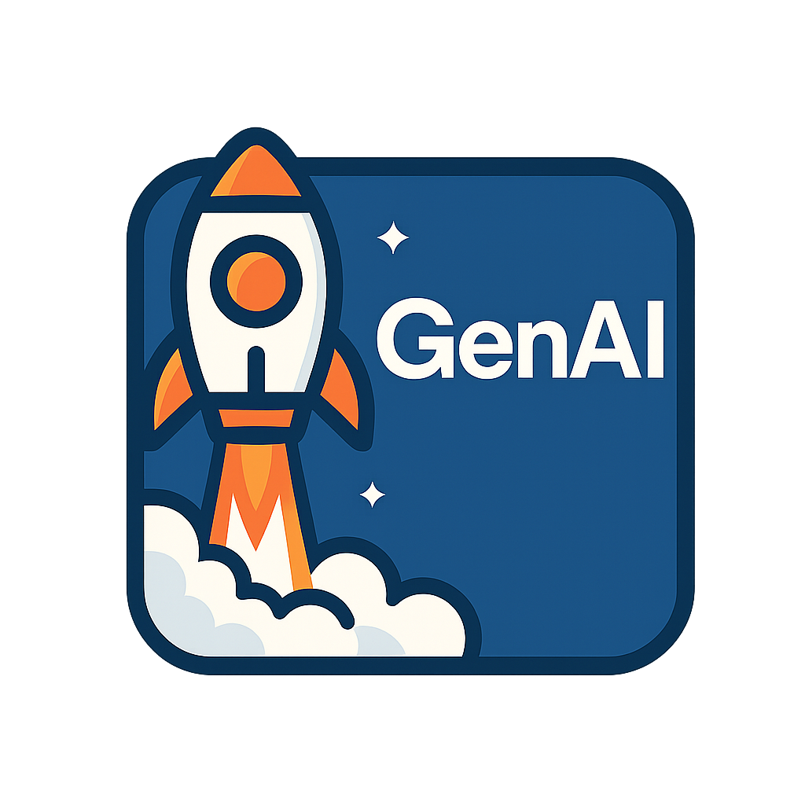

<h1 align="center"> GenAI Foundry <br>
</h1>

<p align="center">
  <a href="https://colab.research.google.com/github/dlwhyte/GenAI_foundry"></a>
  <a href="https://opensource.org/licenses/MIT"></a>
  
  
</p>

## 📢 About GenAI Foundry

This repository was created to make the world of Generative AI **accessible, simple, and hands-on**.

Our mission:

- 🚀 Empower learners to experiment with LLMs and RAG pipelines.
- 🧠 Provide clear, beginner-friendly tutorials.
- 📚 Foster creativity and exploration with GenAI tools.

Feel free to **fork**, **adapt**, and **expand** these examples! 🎯

---

## 🗺️ Learning Path

Follow this sequence for the best experience:

```
① Tokens & Embeddings → ② Semantic Similarity → ③ Simple Chatbot
→ ④ Temperature & Tokens → ⑤ Prompt Engineering → ⑥ Few-Shot / Zero-Shot
→ ⑦ Simple RAG → ⑧ LangChain Basics → ⑨ What is an Agent?
→ 🎓 Interactive Demos (Streamlit) → 🚀 AgenticAI Foundry
```

> 💡 Notebooks marked ✅ **No API Key** run entirely in Google Colab for free. Notebooks marked 🔑 **API Key** require an OpenAI key.

---

## 📚 Tutorials and Notebooks

Welcome to the GenAI Foundry learning series! All notebooks can be opened directly in Google Colab — no local setup required.

### Part 1: LLM Mechanics (No API Key Required)

| # | 📓 Notebook | 📝 Description | 🔑 API Key | 🚀 Colab |
|---|---|---|---|---|
| 1 | Tokens and Embeddings | How LLMs break text into tokens and represent meaning as vectors | ✅ Free | [](https://colab.research.google.com/github/dlwhyte/GenAI_foundry/blob/main/notebooks/tokens_and_embeddings.ipynb) |
| 2 | Semantic Similarity | How embeddings capture meaning and measure similarity between text | ✅ Free | [](https://colab.research.google.com/github/dlwhyte/GenAI_foundry/blob/main/notebooks/semantic_similarity.ipynb) |
| 3 | Search with Embeddings | Using embeddings for semantic search — the foundation of RAG | ✅ Free | 🚧 Coming Soon |
| 4 | Model Selection & Tradeoffs | How to choose the right model for speed, cost, and quality | ✅ Free | 🚧 Coming Soon |

### Part 2: Introductory Concepts (OpenAI API Key Required)

| # | 📓 Notebook | 📝 Description | 🔑 API Key | ⏱️ Time | 🚀 Colab |
|---|---|---|---|---|---|
| 5 | Simple Chatbot | Build your first LLM-powered chatbot | 🔑 Required | ~15 min | [](https://colab.research.google.com/github/dlwhyte/GenAI_foundry/blob/main/notebooks/simple_chatbot.ipynb) |
| 6 | Temperature & Token Explorer | See how temperature and max tokens change LLM output | 🔑 Required | ~20 min | [](https://colab.research.google.com/github/dlwhyte/GenAI_foundry/blob/main/notebooks/temperature_token.ipynb) |
| 7 | Prompt Engineering Basics | Zero-shot prompting, system messages, and output formatting | 🔑 Required | ~25 min | [](https://colab.research.google.com/github/dlwhyte/GenAI_foundry/blob/main/notebooks/prompt_engineering.ipynb) |
| 8 | Few-Shot / Zero-Shot Prompting | Teaching the model with examples vs. instructions alone | 🔑 Required | ~20 min | [](https://colab.research.google.com/github/dlwhyte/GenAI_foundry/blob/main/notebooks/few_shot_zero_shot.ipynb) |
| 9 | Simple RAG Application | Retrieval-Augmented Generation end-to-end | 🔑 Required | ~30 min | [](https://colab.research.google.com/github/dlwhyte/GenAI_foundry/blob/main/notebooks/simple_rag.ipynb) |
| 10 | LangChain Basics | Chains, prompts, and memory with LangChain | 🔑 Required | ~25 min | [](https://colab.research.google.com/github/dlwhyte/GenAI_foundry/blob/main/notebooks/langchain_introduction.ipynb) |
| 11 | Fine-Tuning Basics | Intro to fine-tuning foundation models | 🔑 Required | ~30 min | 🚧 Coming Soon |

### Part 3: Bridge to Agentic AI

| # | 📓 Notebook | 📝 Description | 🔑 API Key | ⏱️ Time | 🚀 Colab |
|---|---|---|---|---|---|
| 12 | What is an Agent? | From chatbots to agents — the Observe→Think→Act loop explained | ✅ Free | ~20 min | [](https://colab.research.google.com/github/dlwhyte/GenAI_foundry/blob/main/notebooks/what_is_an_agent.ipynb) |

---

## 🎓 Applied Generative AI — Interactive Demos

These demos let you **see the concepts from the notebooks in action** — no coding required. They are a multi-page Streamlit application running in a single Docker container.

> 📌 **Notebooks → Demos connection:** The RAG Visual Explorer (below) visualises exactly what happens in notebooks 3 and 9. The RAG Chat demo is the production version of what you build in notebook 9.

### 🔍 RAG Visual Explorer — No API key required
*Connects to: Notebooks 1, 2, 9*

See how Retrieval-Augmented Generation works under the hood:
- **Chunking** — Watch documents split into searchable pieces
- **Embeddings** — See text transform into numerical vectors
- **Vector Space** — Visualise how similar content clusters together
- **Semantic Search** — Compare keyword vs. meaning-based search

### 🧠 Ontology & Counterfactual Reasoning — OpenAI API key required for AI features
*Connects to: Notebooks 7, 8 (prompt engineering concepts)*

Explore structured knowledge and "what if" analysis:
- **Ontology Explorer** — Interactive knowledge graph of cybersecurity risks
- **Counterfactual Analysis** — Test what happens when controls fail
- **LLM Validation** — Verify AI outputs against ground truth

### 🤖 RAG Chat with Estel — OpenAI API key required
*Connects to: Notebooks 9, 10 (RAG + LangChain)*

A complete document-grounded chat assistant powered by RAG:
- **Upload** — Load your own PDF or TXT documents
- **Index** — Documents are chunked, embedded, and stored in a FAISS vector database
- **Chat** — Ask questions and get answers grounded in your uploaded content
- **Learn** — See RAG in action as a complete end-to-end pipeline

📖 [How RAG Chat Works — Deep Dive Guide](docs/)

---

## 🐳 Running the Demos (Docker Required)

📖 [Detailed Docker Guide for Beginners](docs/)

| Step | Command |
|---|---|
| 1. Clone this repo | `git clone https://github.com/dlwhyte/GenAI_foundry.git` |
| 2. Navigate to repo | `cd GenAI_foundry` |
| 3. Build container | `docker build -t genai-foundry .` |
| 4. Run demos | `docker run -p 8501:8501 genai-foundry` |
| 5. Open browser | `http://localhost:8501` |

With an OpenAI API key (required for Ontology demo + RAG Chat):
```
docker run -p 8501:8501 -e OPENAI_API_KEY=sk-your-key-here genai-foundry
```
💡 Without the `-e` flag, you can still enter your API key in the sidebar on any page that requires it.

🔑 [How to Get an OpenAI API Key](https://platform.openai.com/api-keys)

💡 Don't have Docker? Download it from [docker.com/products/docker-desktop](https://www.docker.com/products/docker-desktop/)

---

## 🛠 How to Get Started

**New to all of this? Follow these 3 steps:**

1. **Start with a free notebook** — Click any Colab badge in the Part 1 table above. No account or setup needed.
2. **Get an API key when ready** — [Create an OpenAI key](https://platform.openai.com/api-keys) to unlock the Part 2 notebooks. Costs pennies per session.
3. **Run the interactive demos** — Install [Docker Desktop](https://www.docker.com/products/docker-desktop/), then follow the 5-step table above.

| Action | Description |
|---|---|
| ✅ New to GitHub? | [Start here](https://docs.github.com/en/get-started) |
| ✅ Docker setup | [Learn how to install and use Docker for running demos](docs/) |
| ✅ Open notebooks | Open and run the notebooks directly in Google Colab — click any badge above |
| ✅ Get an API key | [Create your OpenAI API key to enable model access](https://platform.openai.com/api-keys) |

---

## 📝 License

This project is licensed under the MIT License — free to use, modify, and share! See the [LICENSE](LICENSE) file for more details.

---

## 🚀 Ready for the Next Level?

This repo covers the **foundations** of Generative AI — how LLMs work, how to prompt them, and how to build RAG pipelines.

When you're ready to build AI systems that take action in the world, continue to the companion course:

### 👉 [AgenticAI Foundry](https://github.com/dlwhyte/AgenticAI_foundry) — Multi-agent systems, tool use, MCP, and agent security

| GenAI Foundry covers... | AgenticAI Foundry covers... |
|---|---|
| Tokens, embeddings, and how LLMs work | How agents observe, think, and act |
| Prompt engineering and few-shot learning | Multi-agent orchestration with CrewAI |
| RAG pipelines and vector search | Connecting agents to real tools via MCP |
| LangChain basics | Agent security and prompt injection defense |
| _Recommended first_ ✅ | _Take after GenAI Foundry_ ➡️ |
