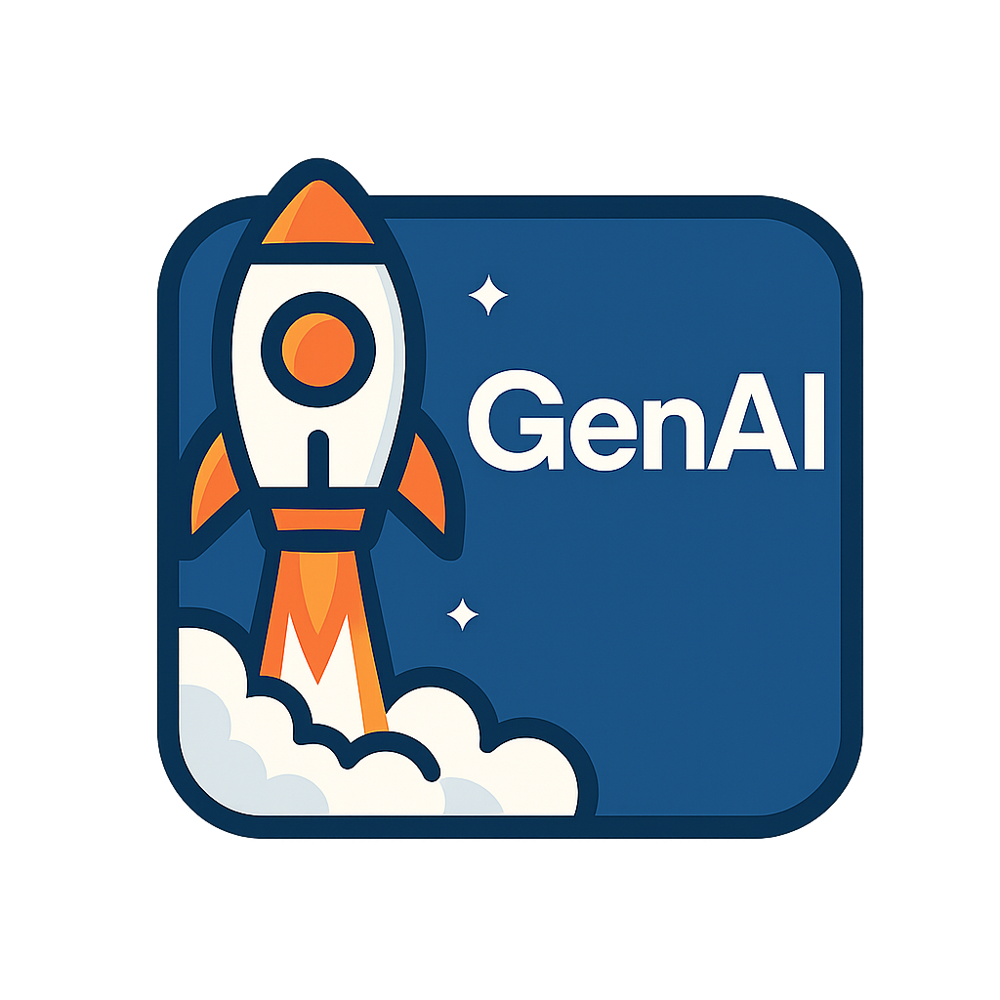

<h1 align="center">
  GenAI_foundry
   
  

## 📥 How to Use

✅ Clone or download this repo.  

✅ Open the Notebooks in **Google Colab** (or locally if you prefer). 

> 📖 [Learn about using Google Colab →](docs/collab_notes.md)

✅ Create an OpenAI API key **OpenAI**.

A step-by-step guide to obtain a key can be found here.
> 🛠 [OpenAI API key →](docs/openai.md)

# 📚 Tutorials and Notebooks

Welcome to the GenAI Foundry learning series!  
Below you’ll find a list of hands-on tutorials designed to help you learn about Large Language Models (LLMs), Retrieval-Augmented Generation (RAG), and more.

---

| 📓 Notebook | 🧠 Description | 🚀 Open in Colab |
|:-----------|:---------------|:----------------|
| [Getting Started with Google Colab](notebooks/getting_started_colab.ipynb) | Introduction to using Colab for GenAI projects. |  |
| [Introduction to LLMs](notebooks/introduction_to_llms.ipynb) | Basics of large language models and prompt engineering. |  |
| [RAG Pipeline Example](notebooks/rag_pipeline_example.ipynb) | Building a retrieval-augmented generation pipeline from scratch. |  |
| [Fine-Tuning Basics](notebooks/fine_tuning_basics.ipynb) | (Coming Soon) Intro to fine-tuning foundation models. | 🚧 Coming Soon |
📚 Follow along with the tutorials and examples.

---

## 📢 About

This repo was created for educational purposes to alllow an introduction into the world of Generative AI.  
The goal is to make learning **simple**, **hands-on**, and **fun**!

Feel free to fork, adapt, and expand upon these examples. 🚀

---

## 📝 License

This project is licensed under the MIT License — free to use, modify, and share.

---

**Happy Learning! 🌟**
