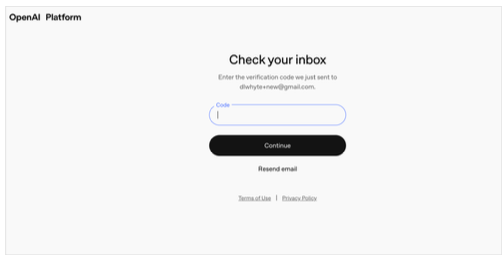
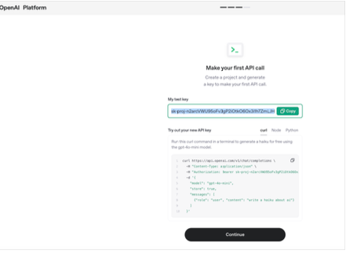

# Getting started with OpenAI 

## Create an account
- Go to the openai.com website

     
- Select the login button on the top right
- Select API platform from the drop down menu

- If you do not have an account you can Sign with a username and a password
- OR: use OAuth authentication if you have an account with one of the companies listed
  

- Enter in your verification code sent to your email address

- Enter in your full name and birth date

  
 - Enter in something for your organization name 
 - Select from the drop down what "best describes you"

 
     

     

  

     
  
     

  
