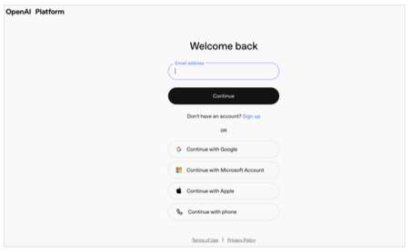
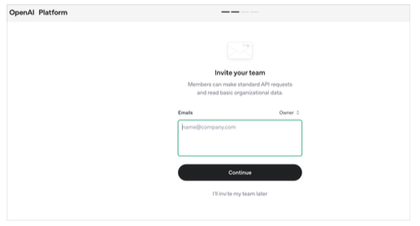
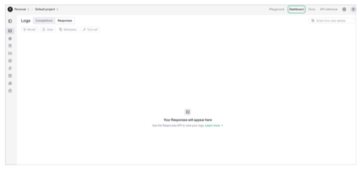
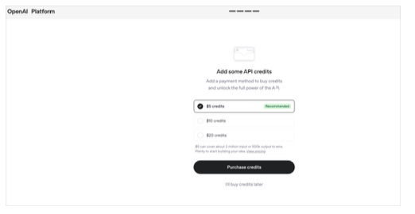
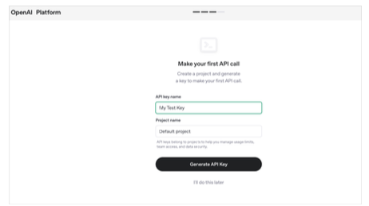
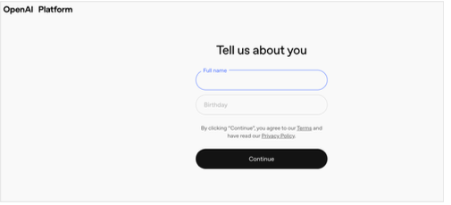
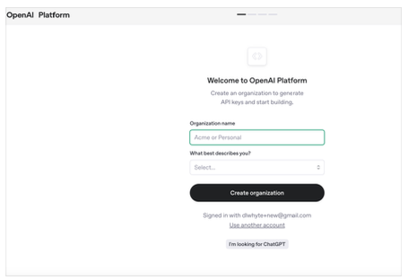
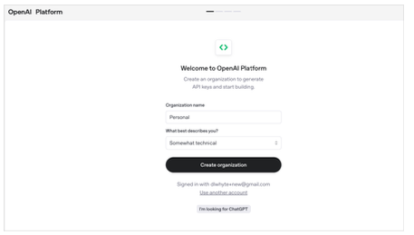
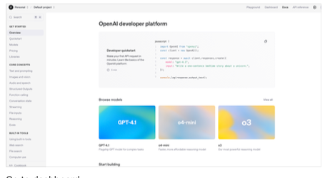

# Getting started with OpenAI 

## Create an account
- Go to the openai.com website
- Select login 

     
- If you do not have an account you can Sign with a username and a password
- OR: use OAuth authentication if you have an account with one of the companies listed 

  

  

    

    
